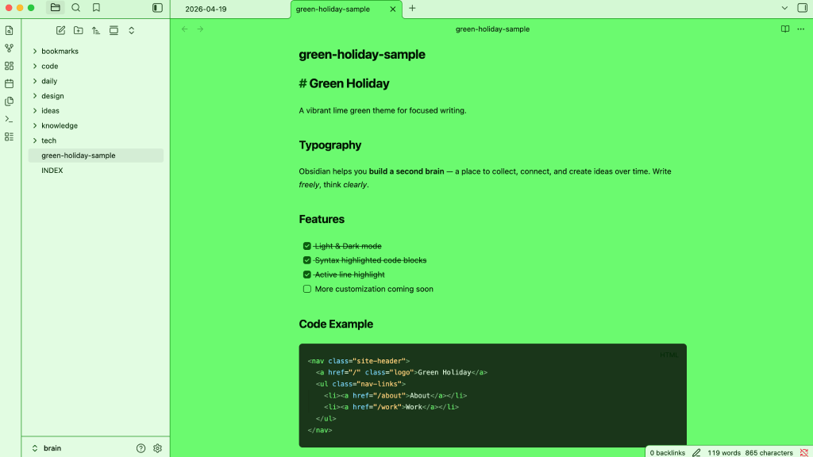
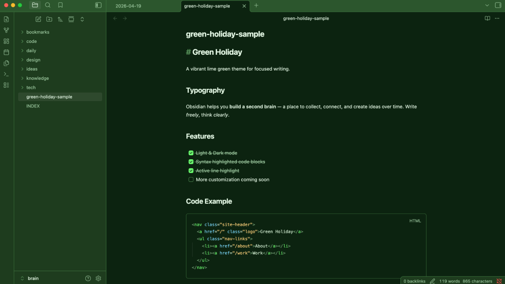

# Green Holiday

A vibrant lime green Obsidian theme for focused writing.
Vivid green backgrounds with dark code blocks for high readability.

---

## Features

- 🌿 Lime green base palette — both light and dark mode
- 💻 Dark code blocks with syntax highlighting on both modes
- 🎯 Code block active line highlight
- 🪟 Soft desaturated sidebar in light mode for clear hierarchy

## Installation

### Via Community Themes (recommended)

1. Open Obsidian **Settings → Appearance → Themes**
2. Click **Browse** and search for `Green Holiday`
3. Click **Install and use**

### Manual

1. Download `theme.css` and `manifest.json`
2. Place them in `{your vault}/.obsidian/themes/Green Holiday/`
3. Open **Settings → Appearance → Themes** and select `Green Holiday`

## License

[MIT](LICENSE) © Masaaki Sumimoto
